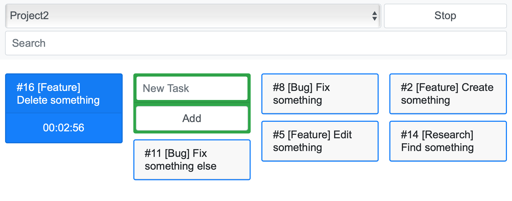

# Ticker

Simple [Redmine](http://www.redmine.org) time tracker



## Usage
```bash
docker run -it -p 9090:9090 \
    -e RM_URL="http://your.redmine.tld" \
    -e RM_USER_TOKEN=50f8c3cbda403fed3b95b124b597b2f927b69fa8 \
    -e RM_USER_ID=5 \
    mrsuh/ticker
```
Open in browser http://127.0.0.1:9090

## Compilation from source
```bash
sh bin/build.sh
php bin/react-worker.php
```
All env parameters are [here](./.env)